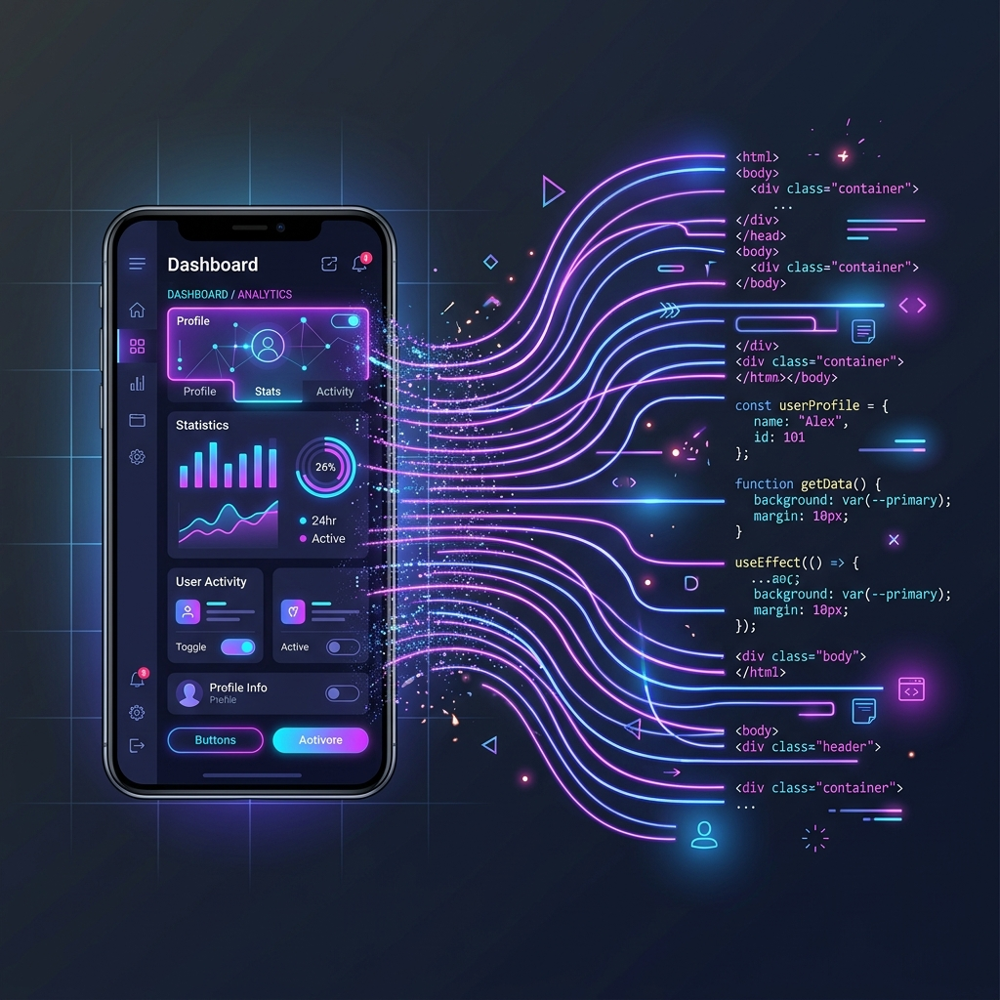

# From Figma to Functional

We've all been there. You get a Slack message from the design team: *"The new landing page is ready!"* You open the Figma link, and it is a breathtaking piece of digital art. The gradients are lush, the typography is perfectly kerned, and it looks like a million bucks.

Then you open your code editor, and the panic sets in.

Turning a static, idealized design into a messy, responsive, production-ready web page is one of the hardest parts of frontend development. Early in my career, I would just start at the top left of the design and try to hack my way down, pixel by pixel. This usually resulted in a CSS file that was 2,000 lines long and completely broke the second you looked at it on an iPad.

Over the years, I've developed a much more systematic approach. If you want to stay sane while translating Figma to functional code, here’s how I do it.

### Phase 1: The Detective Work (Stop, Don't Code Yet)

The worst thing you can do when you get a new design is to immediately start writing HTML. You have to study the file first. 

I usually spend the first 15 minutes just clicking around the Figma file, looking for patterns. Designers love systems, even if they don't explicitly document them. I look for the 3 or 4 shades of grey they use for text. I look for the standard padding they use between sections (is it always 64px or 80px?). 

Before I write any component logic, I translate these patterns into CSS variables or a Tailwind config. 
If you don't do this, I guarantee you will end up with `color: #333333;` in one file, `color: #333334;` in another, and `color: #333;` in a third. Setting up your design tokens first saves you hours of refactoring later.

### Phase 2: The Ugly Block-Out

Once the variables are in place, I build the skeleton. I ignore fonts, colors, and shadows completely. I just focus on the layout architecture. 

I write the semantic HTML and set up the main grid and flexbox containers. To see what I'm doing, I will literally give everything obnoxious background colors. The header gets `background: red;`, the main content area gets `background: blue;`, the sidebar gets `background: limegreen;`. 

It looks absolutely horrendous, but it proves that my structure works. If the layout breaks when I resize the window, it's way easier to fix it now than when there are 50 nested child elements inside of it. Think of it like pouring the concrete foundation before you worry about what color to paint the walls.

### Phase 3: The Mobile Reality Check

Designers almost always present the desktop version of a design first because it looks the most impressive. But developing desktop-first is a trap.

Trying to take a complex, multi-column desktop layout and squish it down into a 320px wide phone screen is a nightmare. It requires writing tons of overriding CSS to undo the desktop rules.

Instead, I always start writing my actual styles for mobile first. It forces you to prioritize the content. How should this stack? What's the most important thing the user needs to see when they load this on the train? Once the mobile view looks good, scaling it up to desktop is usually just a matter of changing a flex direction from `column` to `row`. 

### Phase 4: The Negotiation

This is the most important, and often the most overlooked, part of the job. 

Sometimes, a designer will create something that looks incredible in Figma, but is technically unreasonable to build. Maybe it's a massive video background with a heavy blur filter over it that will absolutely melt the battery of a cheap Android phone. Maybe it's a custom scroll-jacking animation that will take two weeks to build perfectly.

As developers, it's our job to push back gently. Instead of saying, "I can't build this," I try to say, "I can build this, but it will add 3MB to the page load and might drop the frame rate on older phones. What if we tried this slightly simpler approach instead?"

Most of the time, designers aren't trying to make your life difficult; they just don't know the performance implications of what they've drawn. A good frontend engineer doesn't just blindly write code; they act as a bridge between the creative vision and technical reality.
